# layout_flutter

A New Flutter Project for Mobile Programming Week 6.

---

**Nama : Daffa Yudisa Akbar**

**Kelas : TI-3A / 06**

**NIM : 2241720008**

---

## Tugas Praktikum 1
1. Selesaikan Praktikum 1 sampai 4, lalu dokumentasikan dan push ke repository Anda berupa screenshot setiap hasil pekerjaan beserta penjelasannya di file README.md!

    **Jawab:**

* Praktikum 1: Membangun Layout di Flutter
        
    * Langkah 1: membuat sebuah project dengan nama layout_flutter

         

    * Langkah 2: Buka file main.dart lalu ganti dengan kode berikut. Isi nama dan NIM Anda di text title.

        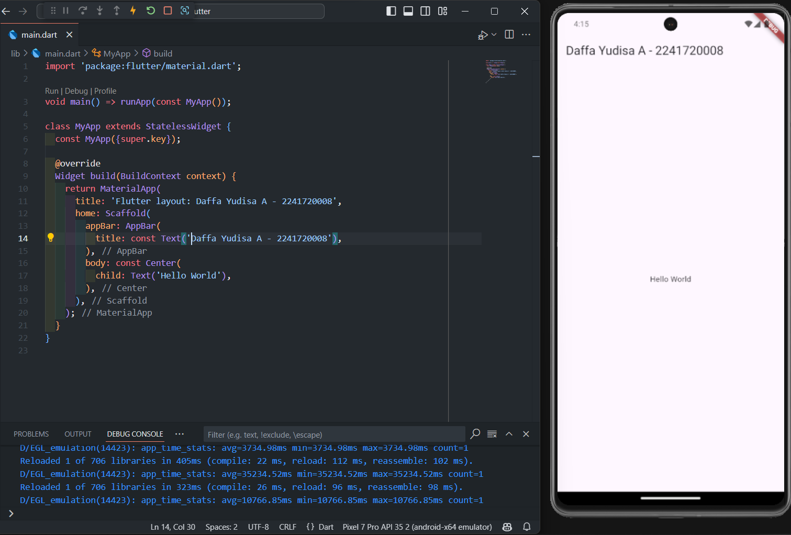 

    * Langkah 3: Identifikasi layout diagram, setelah tata letak telah dibuat diagramnya, cara termudah adalah dengan menerapkan pendekatan bottom-up. Untuk meminimalkan kebingungan visual dari kode tata letak yang banyak bertumpuk, tempatkan beberapa implementasi dalam variabel dan fungsi.
    
    * langkah 4: Membuat kolom bagian kiri pada judul. Tambahkan kode berikut di bagian atas metode build() di dalam kelas MyApp

        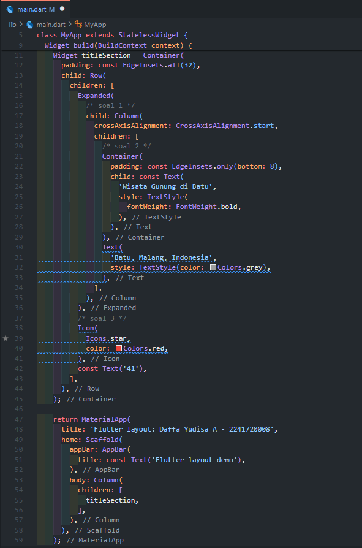 

    * Hasil Praktikum 1 

        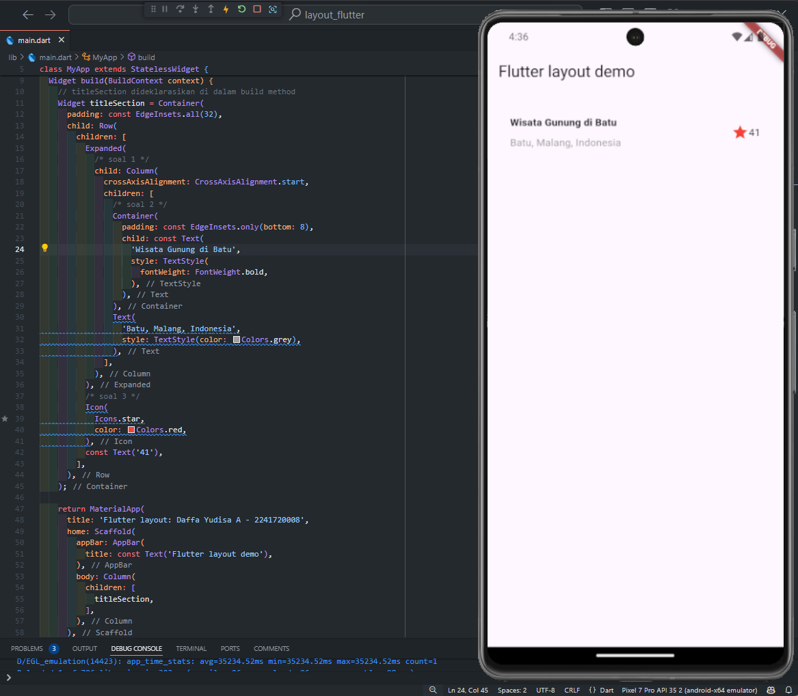 

<br></br>

*  Praktikum 2: Implementasi button row

    * Langkah 1: Buat method Column _buildButtonColumn

        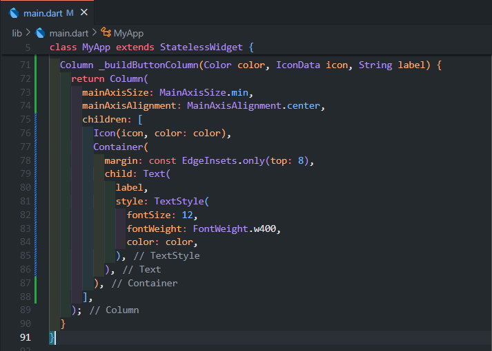 

        Mendefinisikan metode _buildButtonColumn dalam kelas MyApp yang berfungsi untuk membuat sebuah kolom dengan ikon dan teks yang diatur secara vertikal. Metode ini menerima tiga parameter: warna (color), ikon (icon), dan teks (label). Di dalam kolom, ikon ditempatkan di atas teks, dan kedua elemen ini diberi warna sesuai parameter warna yang diberikan. Selain itu, teks diberikan jarak sedikit dari ikon menggunakan Container dengan margin di bagian atas. Metode ini digunakan untuk membangun tombol-tombol yang memiliki tata letak yang sama, dengan ikon dan teks yang konsisten dalam gaya dan warna. 
    
    * Langkah 2 : Buat widget buttonSection

        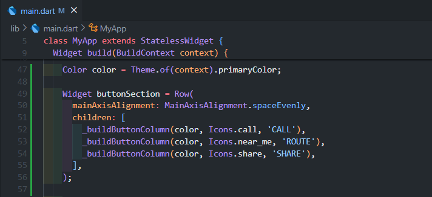

        Kode tersebut membuat sebuah widget Row yang berisi tiga kolom tombol dengan ikon dan teks yang diatur secara horizontal. Warna ikon dan teks diambil dari warna primer tema aplikasi melalui Theme.of(context).primaryColor, yang disimpan dalam variabel color. Masing-masing kolom dibangun menggunakan metode _buildButtonColumn, dengan ikon berbeda (panggilan, rute, dan bagikan) dan teks yang sesuai ('CALL', 'ROUTE', dan 'SHARE'). Tombol-tombol ini diberi jarak yang sama menggunakan mainAxisAlignment: MainAxisAlignment.spaceEvenly, sehingga setiap kolom didistribusikan secara merata di dalam baris.

    * Langkah 3 : Tambah button section ke body

        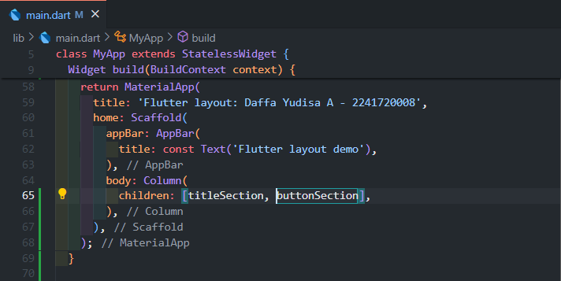

        Variabel buttonSection ditambahkan ke dalam properti body dari widget untuk menampilkan deretan tombol tersebut di bagian utama dari tampilan aplikasi. Dengan menambahkan buttonSection ke dalam body, tombol-tombol yang telah dibuat (CALL, ROUTE, dan SHARE) akan ditampilkan sebagai bagian dari UI aplikasi.

    * Hasil Praktikum 2

        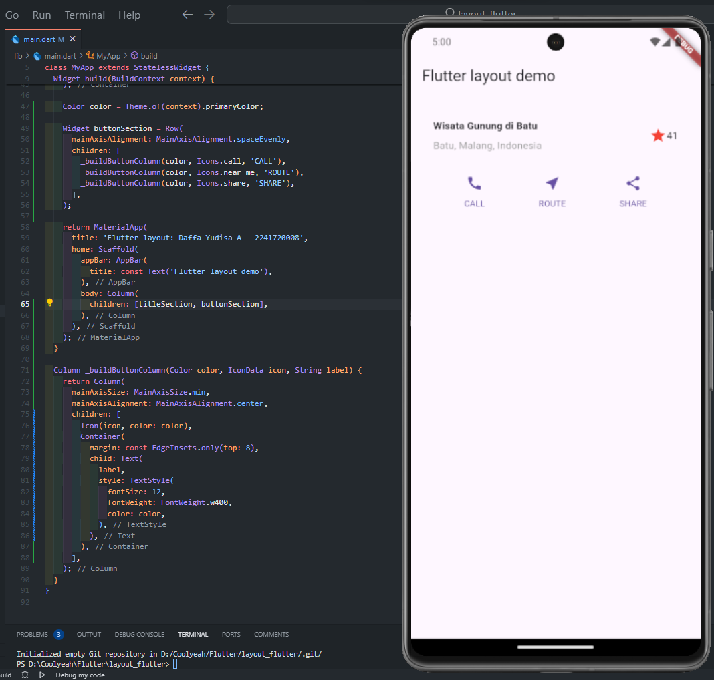

<br></br>

* Praktikum 3: Implementasi text section

    * Langkah 1: Buat widget textSection

        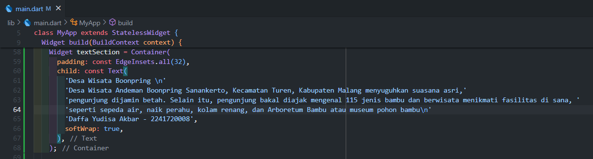

        Kode tersebut membuat sebuah widget textSection yang berisi teks dan menyimpannya dalam sebuah Container untuk diatur tampilannya. Container tersebut diberi padding sebesar 32 piksel di semua sisi untuk memberikan jarak di sekeliling teks.Dengan pengaturan softWrap: true, teks akan secara otomatis membungkus ke baris baru ketika mencapai batas lebar kolom, memastikan teks tetap terbaca dengan baik dalam tata letak aplikasi.

    * Langkah 2: Tambahkan variabel text section ke body

        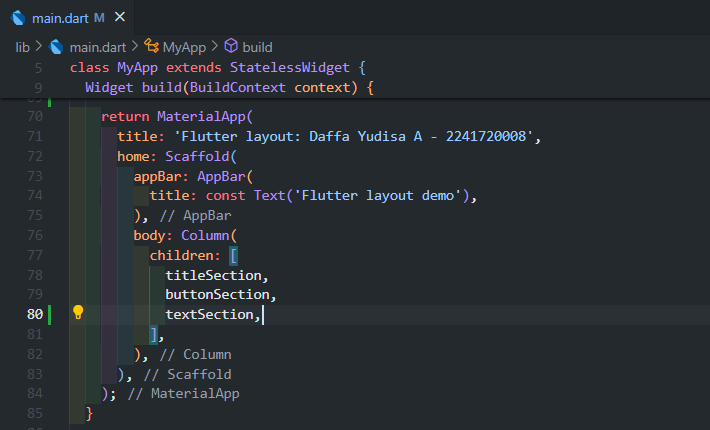

        Menambahkan variabel textSection ke dalam properti body berfungsi untuk menampilkan bagian teks di tampilan utama aplikasi, tepat di bawah tombol-tombol yang sudah dibuat sebelumnya. Dengan menambahkan widget ini ke dalam body, teks yang ada di textSection akan muncul sebagai bagian dari antarmuka pengguna, bersama dengan elemen-elemen lain seperti tombol.

    * Hasil Praktkikum 3

        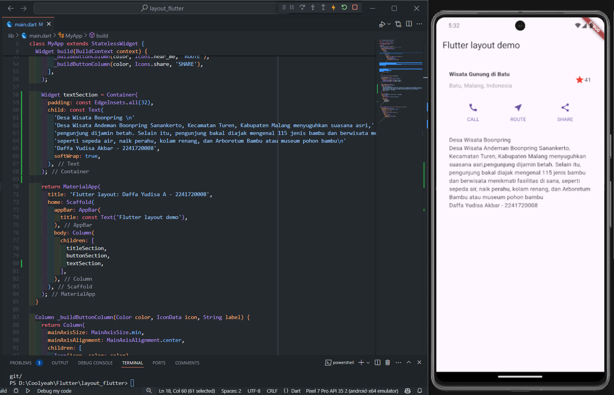

<br></br>

* Praktikum 4: Implementasi image section

    * Langkah 1: Siapkan aset gambar

        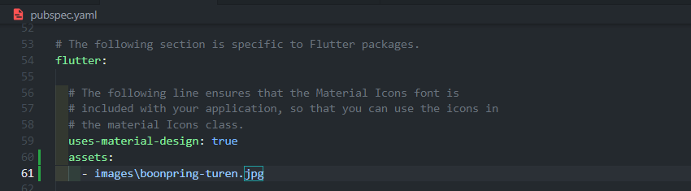

        Deklarasi ini memungkinkan Flutter untuk mengenali dan menggunakan gambar tersebut di dalam aplikasi.

    * Langkah 2: Tambahkan gambar ke body

        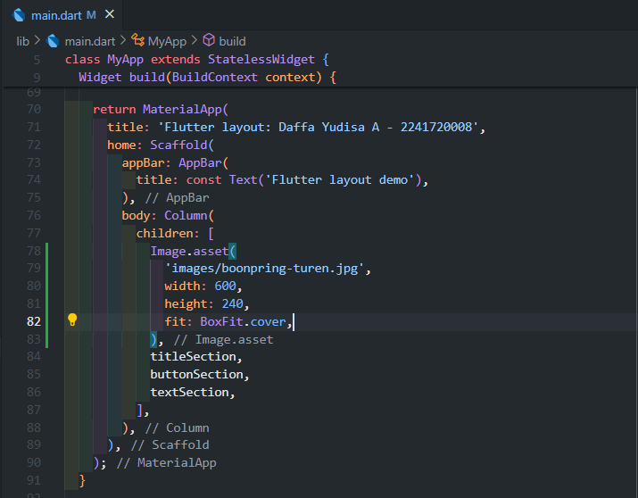

        Kode yang dibuat bertujuan untuk menambahkan gambar sebagai bagian dari UI aplikasi Flutter dan mengatur bagaimana gambar tersebut ditampilkan menggunakan properti BoxFit.cover. Properti ini memastikan gambar mengisi seluruh area tampilan yang disediakan (kotak render), tanpa mengubah rasio aspeknya, sehingga gambar tetap proporsional namun memenuhi area yang ditentukan.

    * Langkah 3: Terakhir, ubah menjadi ListView

        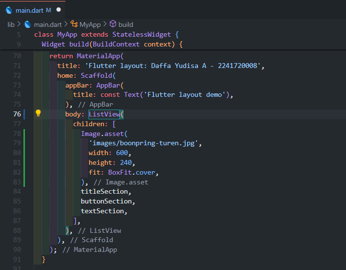

        Kode yang dibuat bertujuan untuk menggantikan widget Column dengan ListView agar mendukung scrolling dinamis. Ini memungkinkan semua elemen (tombol, gambar, teks) ditampilkan dengan baik bahkan pada perangkat dengan resolusi kecil atau ketika konten melebihi ukuran layar. ListView akan membuat elemen-elemen dapat digulir (scrollable) secara vertikal.
    
    * Hasil Praktikum 4 
    
        

<br></br>

2. Silakan implementasikan di project baru "basic_layout_flutter" dengan mengakses sumber ini: https://docs.flutter.dev/codelabs/layout-basics

    **Jawab:**
    Link Project:
   
    https://github.com/daffayudisaa/layout_flutter/tree/master/basic_layout_flutter

    Hasil Run Program:
    
    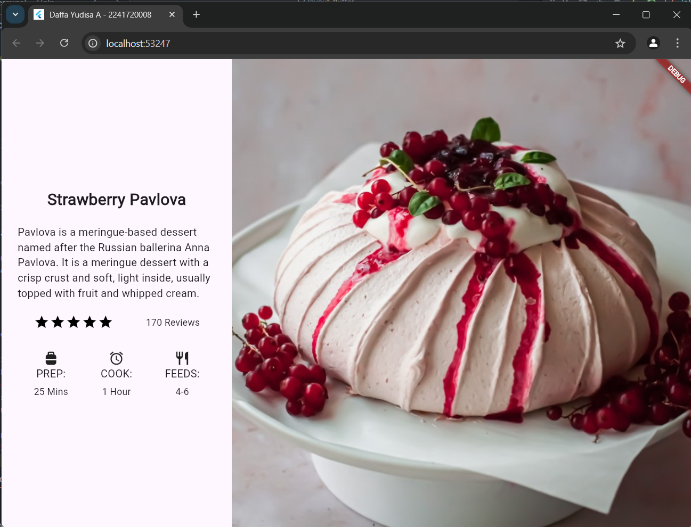

---
<br></br>

**Hasil Run Pada Praktikum 5**

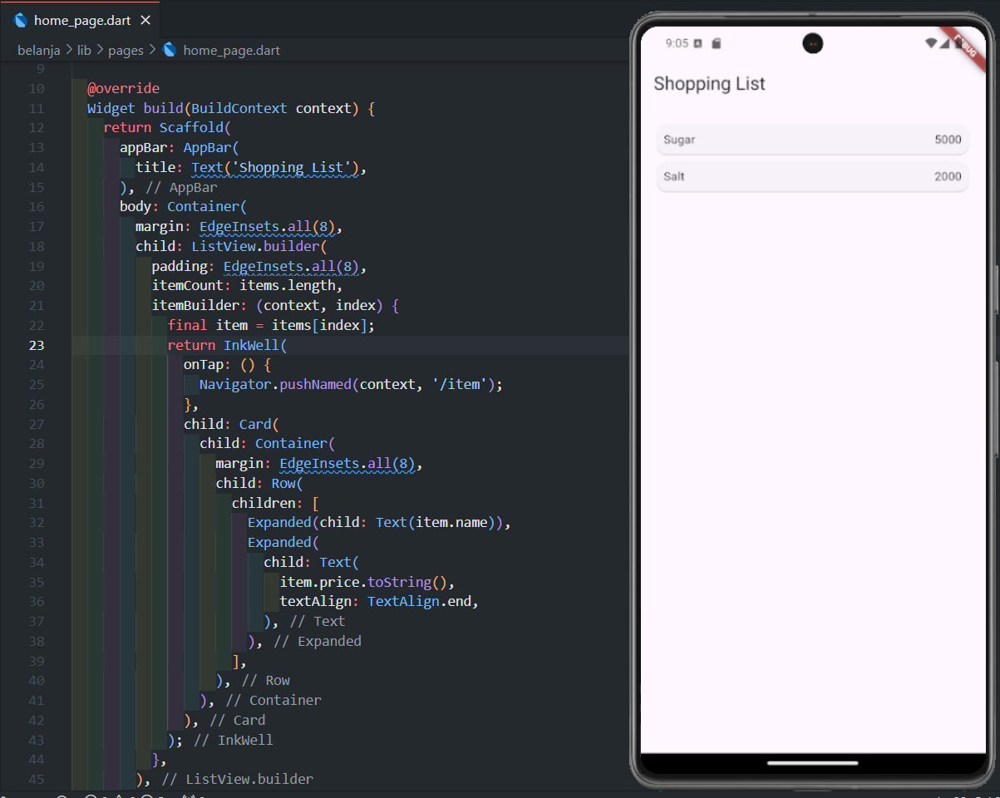

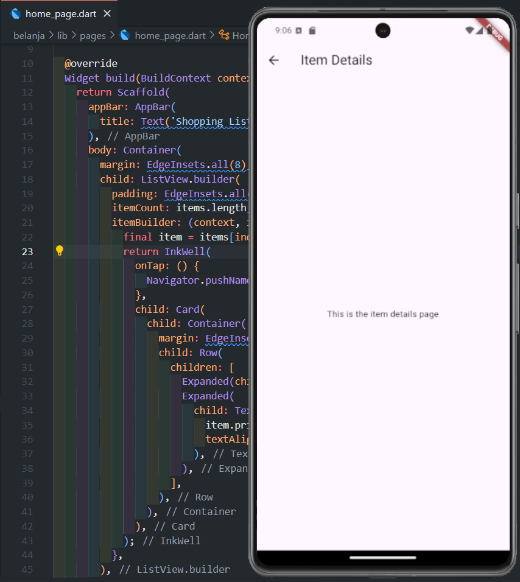

---

## Tugas Praktikum 2

1. Untuk melakukan pengiriman data ke halaman berikutnya, cukup menambahkan informasi arguments pada penggunaan Navigator. Perbarui kode pada bagian Navigator menjadi seperti berikut.

    ```dart
    Navigator.pushNamed(context, '/item', arguments: item);
    ```

    **Jawab:**

    * home_page.dart:

        .png)

    Setelah menambahkan kode Navigator.pushNamed(context, '/item', arguments: item); di dalam onTap pada widget InkWell di home_page.dart, aplikasi sekarang dapat mengirim objek Item yang dipilih dari daftar ke halaman ItemPage. Saat pengguna menekan salah satu item dalam daftar, aplikasi akan mengalihkan pengguna ke halaman ItemPage, di mana informasi tentang item tersebut, termasuk nama dan harga, ditampilkan.

<br></br>

2. Pembacaan nilai yang dikirimkan pada halaman sebelumnya dapat dilakukan menggunakan ModalRoute. Tambahkan kode berikut pada blok fungsi build dalam halaman ItemPage. Setelah nilai didapatkan, anda dapat menggunakannya seperti penggunaan variabel pada umumnya. (https://docs.flutter.dev/cookbook/navigation/navigate-with-arguments)

    ```dart
    final itemArgs = ModalRoute.of(context)!.settings.arguments as Item;
    ```

    **Jawab:**

    * item_page.dart:

    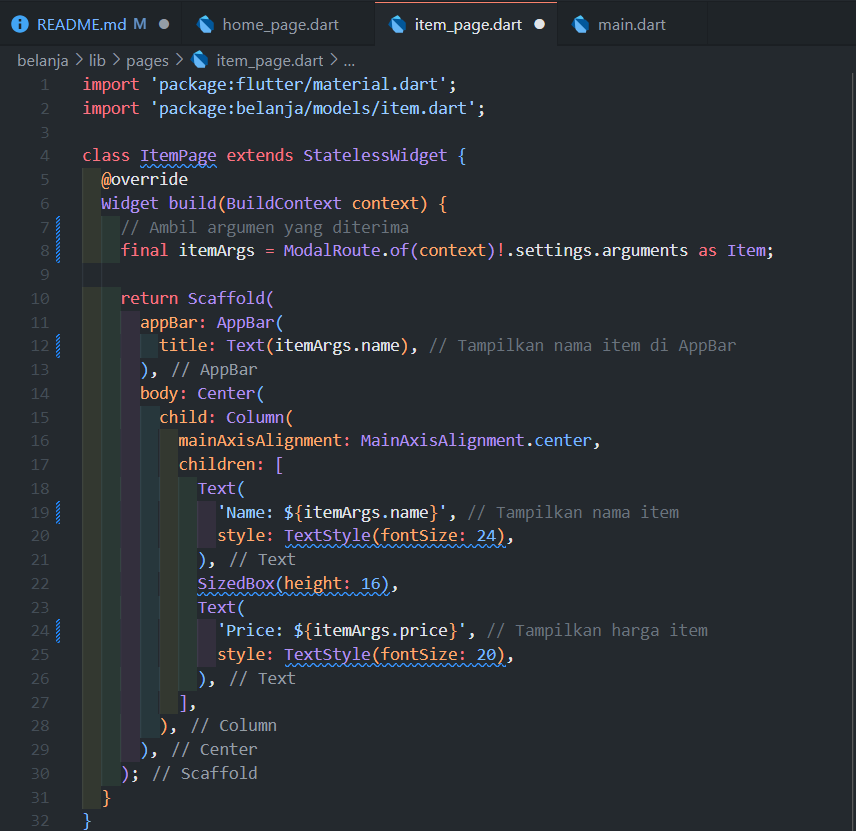

    * main.dart dan output:

    .png)

    Kode final itemArgs = ModalRoute.of(context)!.settings.arguments as Item; digunakan untuk mengambil argumen yang dikirimkan ke halaman ItemPage saat navigasi terjadi. Dalam konteks Flutter, ModalRoute.of(context) mengakses rute saat ini yang aktif dan memberikan informasi tentang rute tersebut. settings.arguments berisi data yang diteruskan saat pengguna menavigasi ke halaman ini, yang dalam hal ini adalah objek Item. Dengan menggunakan as Item, kita melakukan casting pada objek tersebut, memastikan bahwa data yang diterima adalah tipe yang diharapkan, yaitu Item. Setelah argumen diambil, variabel itemArgs dapat digunakan untuk mengakses properti dari objek Item, seperti itemArgs.name dan itemArgs.price, yang memungkinkan tampilan informasi item yang relevan di antarmuka pengguna.

<br></br>

3. Pada hasil akhir dari aplikasi belanja yang telah anda selesaikan, tambahkan atribut foto produk, stok, dan rating. Ubahlah tampilan menjadi GridView seperti di aplikasi marketplace pada umumnya.

    **Jawab:**

    * item.dart:

    .png)

    Pada file item.dart ditambahkan 3 atribut, yakni String imageUrl yang berfungsi untuk menyimpan url gambar dari produk, int stock yang berfungsi untuk menyimpan informasi mengenai stock, dan double rating yang berfungsi untuk menyimpan informasi mengenai rating dari produk.

    * home_page.dart:
    
    .png) 

    Pada bagian ini ditambahkan beberapa barang lagi dengan atribut tambahan yang telah didefinisikan pada file item.dart seperti imageUrl, stock, dan rating.

    .png)

    Kode di atas merupakan bagian dari aplikasi Flutter yang menampilkan daftar produk dalam bentuk grid menggunakan GridView.builder. Setiap item dalam grid menampilkan informasi produk seperti nama, harga, stok, rating, dan gambar produk yang diambil dari URL. Grid diatur menggunakan SliverGridDelegateWithMaxCrossAxisExtent, yang memungkinkan penentuan ukuran maksimum tiap item di grid (dalam hal ini 300 piksel). childAspectRatio menentukan perbandingan antara tinggi dan lebar tiap item untuk menjaga proporsi visual. Jarak antar item diatur dengan crossAxisSpacing dan mainAxisSpacing.

    * item_page.dart

    .png)

    Kode di atas merupakan halaman detail produk dalam aplikasi Flutter yang menggunakan ItemPage untuk menampilkan informasi lengkap mengenai sebuah produk yang dikirimkan dari halaman HomePage. 
    Dalam tampilan halaman, terdapat gambar produk yang ditampilkan menggunakan Image.network, diikuti dengan informasi seperti nama, harga, stok, dan rating produk.

    * Hasil:

    .png)

    .png)

<br></br>

4. Silakan implementasikan Hero widget pada aplikasi belanja Anda dengan mempelajari dari sumber ini: https://docs.flutter.dev/cookbook/navigation/hero-animations

    **Jawab:**

    * home_page.dart:

    .png)

    * item_page.dart:

    .png)

    Kode di atas menggunakan Hero widget untuk memberikan animasi transisi yang mulus antara halaman daftar produk dan halaman detail produk pada aplikasi belanja. Hero widget membungkus gambar produk di kedua halaman dengan tag unik, yaitu nama produk, yang memungkinkan Flutter mengenali elemen yang sama di kedua halaman saat transisi. Ketika pengguna mengetuk gambar produk pada halaman utama (HomePage), aplikasi akan menavigasi ke halaman detail (ItemPage), dan gambar produk akan beranimasi secara mulus, membesar atau mengecil sesuai konteks halaman.

    * Hasil:

    .gif)
    
<br></br>

5. Sesuaikan dan modifikasi tampilan sehingga menjadi aplikasi yang menarik. Selain itu, pecah widget menjadi kode yang lebih kecil. Tambahkan Nama dan NIM di footer aplikasi belanja Anda.

    **Jawab:**
    * List Item

    .png)

    * Widget Menampilkan Grid Produk

    .png)

    * Widget Menampilkan Card Produk

    .png)

    * Widget Untuk Footer
    
    .png)

    * Hasil:

    .png)

<br></br>

6. Selesaikan Praktikum 5: Navigasi dan Rute tersebut. Cobalah modifikasi menggunakan plugin go_router, lalu dokumentasikan dan push ke repository Anda berupa screenshot setiap hasil pekerjaan beserta penjelasannya di file README.md.

    **Jawab:**

    * Mempersiapkan go_router

    .png)

    * main.dart:

    .png)

    Kode di atas adalah implementasi aplikasi Flutter sederhana yang menggunakan GoRouter untuk navigasi antara dua halaman: HomePage dan ItemPage. Dalam konfigurasi router, terdapat dua rute utama: rute untuk halaman beranda ('/') yang menampilkan HomePage, dan rute untuk halaman item ('/item') yang menampilkan ItemPage.

    * home_page.dart:

    .png)

    Dalam kode di atas, GoRouter diterapkan untuk mengelola navigasi dalam aplikasi Flutter yang menampilkan daftar belanja. Pada HomePage, ketika pengguna mengetuk salah satu produk dalam ProductCard, fungsi onTap memanggil context.go('/item', extra: item) untuk mengarahkan pengguna ke halaman detail produk (ItemPage). Di sini, extra: item digunakan untuk meneruskan objek Item yang diklik ke halaman baru, memungkinkan halaman tersebut untuk menampilkan informasi detail tentang produk tersebut. 

    * item_page.dart:

    .png)

    Pada kode ItemPage, GoRouter digunakan untuk mengambil argumen yang diteruskan dari halaman sebelumnya (dalam hal ini, HomePage) menggunakan GoRouterState.of(context).extra as Item. Ini memungkinkan ItemPage untuk mengakses detail item yang dipilih, termasuk nama, harga, stok, dan rating. Dengan memanfaatkan fitur ini, aplikasi dapat menampilkan informasi produk yang relevan secara dinamis saat pengguna beralih ke halaman detail. Selain itu, terdapat tombol kembali yang mengarahkan pengguna kembali ke halaman utama menggunakan context.go('/'), yang menunjukkan kemudahan navigasi antar halaman dalam aplikasi. 

    * Hasil:

    .gif)

---


