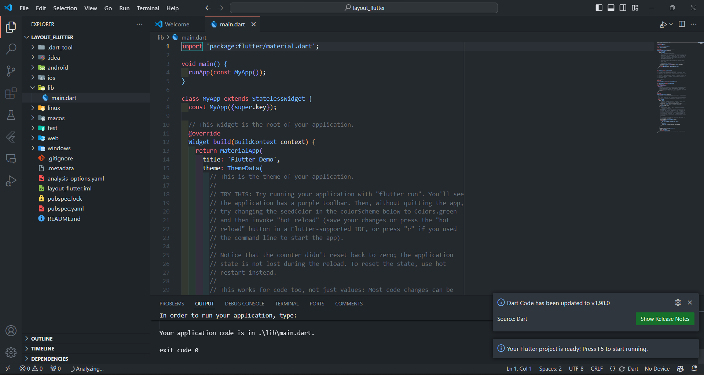
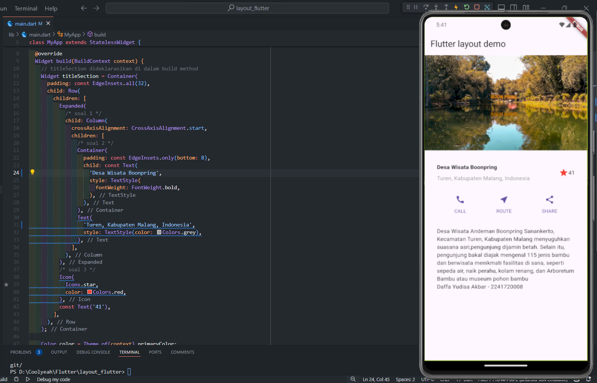

# layout_flutter

A New Flutter Project for Mobile Programming Week 6.

---

**Nama : Daffa Yudisa Akbar**

**Kelas : TI-3A / 06**

**NIM : 2241720008**

---

## Tugas Praktikum 1
1. Selesaikan Praktikum 1 sampai 4, lalu dokumentasikan dan push ke repository Anda berupa screenshot setiap hasil pekerjaan beserta penjelasannya di file README.md!

    **Jawab:**

* Praktikum 1: Membangun Layout di Flutter
        
    * Langkah 1: membuat sebuah project dengan nama layout_flutter

         

    * Langkah 2: Buka file main.dart lalu ganti dengan kode berikut. Isi nama dan NIM Anda di text title.

         

    * Langkah 3: Identifikasi layout diagram, setelah tata letak telah dibuat diagramnya, cara termudah adalah dengan menerapkan pendekatan bottom-up. Untuk meminimalkan kebingungan visual dari kode tata letak yang banyak bertumpuk, tempatkan beberapa implementasi dalam variabel dan fungsi.
    
    * langkah 4: Membuat kolom bagian kiri pada judul. Tambahkan kode berikut di bagian atas metode build() di dalam kelas MyApp

         

    * Hasil Praktikum 1 

         

  

*  Praktikum 2: Implementasi button row

    * Langkah 1: Buat method Column _buildButtonColumn

         

        Mendefinisikan metode _buildButtonColumn dalam kelas MyApp yang berfungsi untuk membuat sebuah kolom dengan ikon dan teks yang diatur secara vertikal. Metode ini menerima tiga parameter: warna (color), ikon (icon), dan teks (label). Di dalam kolom, ikon ditempatkan di atas teks, dan kedua elemen ini diberi warna sesuai parameter warna yang diberikan. Selain itu, teks diberikan jarak sedikit dari ikon menggunakan Container dengan margin di bagian atas. Metode ini digunakan untuk membangun tombol-tombol yang memiliki tata letak yang sama, dengan ikon dan teks yang konsisten dalam gaya dan warna. 
    
    * Langkah 2 : Buat widget buttonSection

        

        Kode tersebut membuat sebuah widget Row yang berisi tiga kolom tombol dengan ikon dan teks yang diatur secara horizontal. Warna ikon dan teks diambil dari warna primer tema aplikasi melalui Theme.of(context).primaryColor, yang disimpan dalam variabel color. Masing-masing kolom dibangun menggunakan metode _buildButtonColumn, dengan ikon berbeda (panggilan, rute, dan bagikan) dan teks yang sesuai ('CALL', 'ROUTE', dan 'SHARE'). Tombol-tombol ini diberi jarak yang sama menggunakan mainAxisAlignment: MainAxisAlignment.spaceEvenly, sehingga setiap kolom didistribusikan secara merata di dalam baris.

    * Langkah 3 : Tambah button section ke body

        

        Variabel buttonSection ditambahkan ke dalam properti body dari widget untuk menampilkan deretan tombol tersebut di bagian utama dari tampilan aplikasi. Dengan menambahkan buttonSection ke dalam body, tombol-tombol yang telah dibuat (CALL, ROUTE, dan SHARE) akan ditampilkan sebagai bagian dari UI aplikasi.

    * Hasil Praktikum 2

        

  

* Praktikum 3: Implementasi text section

    * Langkah 1: Buat widget textSection

        

        Kode tersebut membuat sebuah widget textSection yang berisi teks dan menyimpannya dalam sebuah Container untuk diatur tampilannya. Container tersebut diberi padding sebesar 32 piksel di semua sisi untuk memberikan jarak di sekeliling teks.Dengan pengaturan softWrap: true, teks akan secara otomatis membungkus ke baris baru ketika mencapai batas lebar kolom, memastikan teks tetap terbaca dengan baik dalam tata letak aplikasi.

    * Langkah 2: Tambahkan variabel text section ke body

        

        Menambahkan variabel textSection ke dalam properti body berfungsi untuk menampilkan bagian teks di tampilan utama aplikasi, tepat di bawah tombol-tombol yang sudah dibuat sebelumnya. Dengan menambahkan widget ini ke dalam body, teks yang ada di textSection akan muncul sebagai bagian dari antarmuka pengguna, bersama dengan elemen-elemen lain seperti tombol.

    * Hasil Praktkikum 3

        

  

* Praktikum 4: Implementasi image section

    * Langkah 1: Siapkan aset gambar

        

        Deklarasi ini memungkinkan Flutter untuk mengenali dan menggunakan gambar tersebut di dalam aplikasi.

    * Langkah 2: Tambahkan gambar ke body

        

        Kode yang dibuat bertujuan untuk menambahkan gambar sebagai bagian dari UI aplikasi Flutter dan mengatur bagaimana gambar tersebut ditampilkan menggunakan properti BoxFit.cover. Properti ini memastikan gambar mengisi seluruh area tampilan yang disediakan (kotak render), tanpa mengubah rasio aspeknya, sehingga gambar tetap proporsional namun memenuhi area yang ditentukan.

    * Langkah 3: Terakhir, ubah menjadi ListView

        

        Kode yang dibuat bertujuan untuk menggantikan widget Column dengan ListView agar mendukung scrolling dinamis. Ini memungkinkan semua elemen (tombol, gambar, teks) ditampilkan dengan baik bahkan pada perangkat dengan resolusi kecil atau ketika konten melebihi ukuran layar. ListView akan membuat elemen-elemen dapat digulir (scrollable) secara vertikal.
    
    * Hasil Praktikum 4 
    
        

2. Silakan implementasikan di project baru "basic_layout_flutter" dengan mengakses sumber ini: https://docs.flutter.dev/codelabs/layout-basics

    **Jawab:**
    Link Project:
   
    https://github.com/daffayudisaa/layout_flutter/tree/master/basic_layout_flutter

    Hasil Run Program:
    
    
